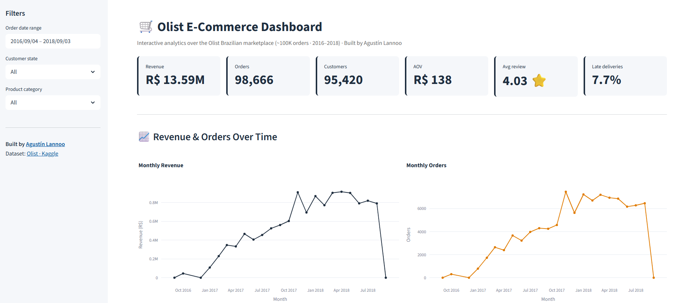
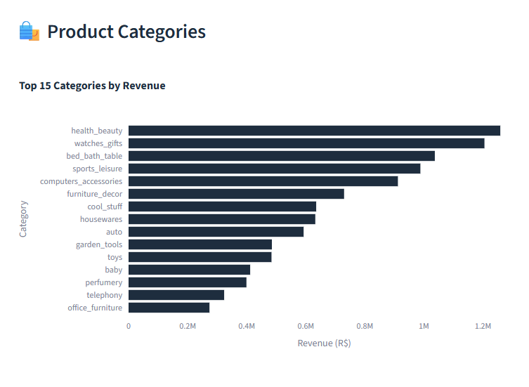
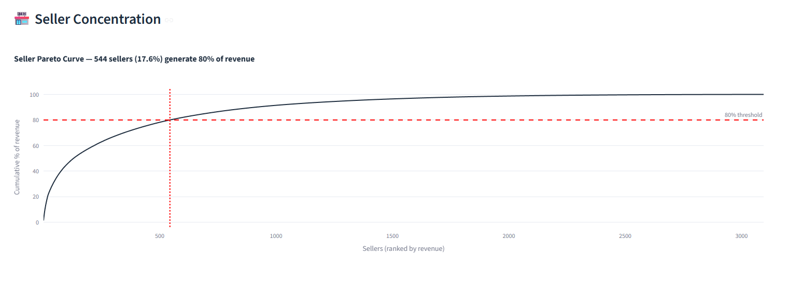

# Olist E-Commerce Analysis


> End-to-end analytical project on the Olist Brazilian E-Commerce dataset (~100K orders, 2016 to 2018). Combines exploratory data analysis in Jupyter, a curated set of business insights, and an interactive Streamlit dashboard.

**Live Dashboard:** https://lannoo-olist-dashboard.streamlit.app/
**EDA Notebook:** [notebooks/01_olist_eda.ipynb](notebooks/01_olist_eda.ipynb)

---

## Business Questions

This analysis answers six core questions a marketplace operator would ask:

1. How did sales evolve over time, and what does seasonality look like?
2. Which product categories dominate revenue and order volume?
3. Where are customers geographically concentrated, and where is the growth opportunity?
4. How long does it take to deliver, and how does it impact customer satisfaction?
5. Which sellers drive most of the GMV, and how concentrated is the supply side?
6. What predicts a 5-star review vs a 1-star one?

---

## Headline KPIs

| Metric | Value |
| --- | --- |
| Total Revenue | R$ 13.59M |
| Orders | 98,666 |
| Unique Customers | 95,420 |
| Average Order Value | R$ 138 |
| Average Review Score | 4.03 stars |
| Median Delivery Time | 10 days |
| Late Delivery Rate | 6.8% |
| Total Sellers | ~3,095 |

---

## Dashboard Preview

Interactive Streamlit dashboard deployed at https://lannoo-olist-dashboard.streamlit.app/

### Overview & Headline KPIs


### Product Categories & Geographic Distribution


### Seller Concentration (Pareto)


---

## Key Findings

### 1. Strong growth phase with clear ramp-up
Monthly revenue grew from near-zero in late 2016 to a stable ~R$ 0.85M monthly level by 2018, a multi-fold expansion that reflects rapid product-market fit. The plateau in 2018 suggests the marketplace reached its operational scale ceiling and would require structural changes for further growth.

### 2. Acquisition-driven, retention-poor business
With 95,420 unique customers across 98,666 orders, the ratio is 1.03 orders per customer, almost no repeat purchase behavior. This is the most actionable insight: the business acquires first-time buyers well but fails to convert them into repeat customers. Loyalty programs, post-purchase comms, and re-engagement campaigns are the obvious lever.

### 3. Diversified category mix, no single dominant winner
Top categories by revenue are health_beauty (R$ 1.25M), watches_gifts (R$ 1.20M) and bed_bath_table (R$ 1.05M), but no single category exceeds ~10% of total revenue. Olist is a generalist marketplace, not a vertical specialist, which is a healthy diversification that reduces concentration risk.

### 4. Extreme geographic concentration in the Southeast
Sao Paulo + Rio de Janeiro + Minas Gerais = ~62% of total revenue. Sao Paulo alone generates ~38% (R$ 5.2M). The North and Northeast regions are virtually untapped (each under 3%), representing a clear expansion frontier if logistics can be solved.

### 5. Delivery time is the strongest CSAT driver
The correlation between delivery time and review score is direct and material:

| Review score | Avg delivery time |
| --- | --- |
| 5 stars | 10 days |
| 4 stars | 12 days |
| 3 stars | 14 days |
| 2 stars | 16 days |
| 1 star | 21 days |

Customers who get their orders in 10 days rate the experience 2.1x more positively than those waiting 21 days. Investing in logistics directly translates into satisfaction and likely retention.

### 6. Classic Pareto on the supply side
544 sellers (17.6%) generate 80% of total GMV out of ~3,095 active sellers. This is a textbook long-tail distribution: a small group of top performers drives most of the marketplace, while the long tail provides catalog breadth. A tiered seller management strategy (key account treatment for the top 544) is justified.

---

## Tech Stack

| Layer | Tools |
| --- | --- |
| Data manipulation | pandas, numpy |
| Visualization | matplotlib, seaborn, plotly |
| Interactive dashboard | streamlit |
| Notebook environment | Jupyter |
| Version control | Git / GitHub |
| Deployment | Streamlit Community Cloud |

---

## Repository Structure

```
olist-ecommerce-analysis/
| data/                          CSVs from Kaggle (see data/README.md)
| notebooks/
|   01_olist_eda.ipynb           Full exploratory data analysis
| streamlit_app/
|   app.py                       Interactive dashboard
| outputs/
|   screenshots/                 Dashboard screenshots
|   figures/                     Exported plots from notebook
| .streamlit/config.toml         Streamlit theme configuration
| requirements.txt
| README.md
```

---

## How to Run Locally

```bash
git clone https://github.com/Alannoo6/olist-ecommerce-analysis.git
cd olist-ecommerce-analysis

python -m venv venv
venv\Scripts\activate
pip install -r requirements.txt

jupyter notebook notebooks/01_olist_eda.ipynb
streamlit run streamlit_app/app.py
```

The 9 CSVs from Kaggle are required. Follow the instructions in `data/README.md` to download them.

---

## Dataset

The Olist Brazilian E-Commerce Public Dataset contains real, anonymized transactional data from the Olist marketplace, made publicly available by the company.

- Period: September 2016 to October 2018
- Volume: ~100,000 orders across 8 relational tables
- Source: https://www.kaggle.com/datasets/olistbr/brazilian-ecommerce
- License: CC BY-NC-SA 4.0

---

## Author

Agustin Lannoo, Data Analyst & BI Engineer

- LinkedIn: https://www.linkedin.com/in/agustin-lannoo/
- GitHub: https://github.com/Alannoo6
